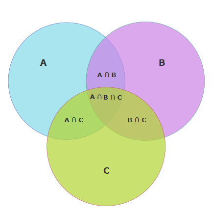

### Introduction

A fault model is an engineering model of something that could go wrong in the construction or operation of a piece of equipment, A stuck-at fault is a particular fault model used by fault simulators, Individual signals and pins are assumed to be stuck at Logical '1', '0' . For example, an input is tied to a logical 1 state during test generation to assure that a manufacturing defect with that type of behaviour can be found with a specific test pattern. The even function is equal to 1 when the number of 1’s in the input combination is even.

The complement of an odd function is an even function. The complement of an odd function (an even function) is obtained by replacing the output gate with an Exclusive-NOR gate

Combinational circuit is a circuit in which we combine the different gates in the circuit, for example encoder, decoder, multiplexer and demultiplexer. Some of the characteristics of combinational circuits are following −

1. The output of combinational circuit at any instant of time, depends only on the levels present at input terminals.
2. The combinational circuit do not use any memory. The previous state of input does not have any effect on the present state of the circuit.
3. A combinational circuit can have an n number of inputs and m number of outputs.

Various representations related to combinational circuits:

<strong>Truth Table:</strong> 
A truth table is a mathematical table used in logic—specifically in Boolean algebra, digital electronics, and computer science—to represent the outputs of a logic circuit or Boolean function for all possible combinations of inputs.

<table style="text-align:center;">
  <tr  style="text-align:center;"><th>A</th><th>B</th><th>Output (A AND B)</th></tr>
  <tr  style="text-align:center;"><td>0</td><td>0</td><td style="text-align:center;">0</td></tr>
  <tr style="text-align:center;"><td>0</td><td>1</td><td style="text-align:center;">0</td></tr>
  <tr style="text-align:center;"><td>1</td><td>0</td><td style="text-align:center;">0</td></tr>
  <tr style="text-align:center;"><td>1</td><td>1</td><td style="text-align:center;">1</td></tr>
</table>

<strong>Venn Diagram:</strong> 
A Venn diagram is a visual tool that shows relationships between different sets using overlapping circles. In logic, it helps represent operations like AND, OR, and NOT clearly.

<strong>Minimal terms (minterms):</strong> 
Minimal terms are the simplest form of product terms in a Boolean function where each variable appears once in either complemented or uncomplemented form.

